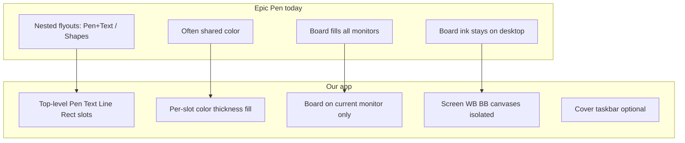
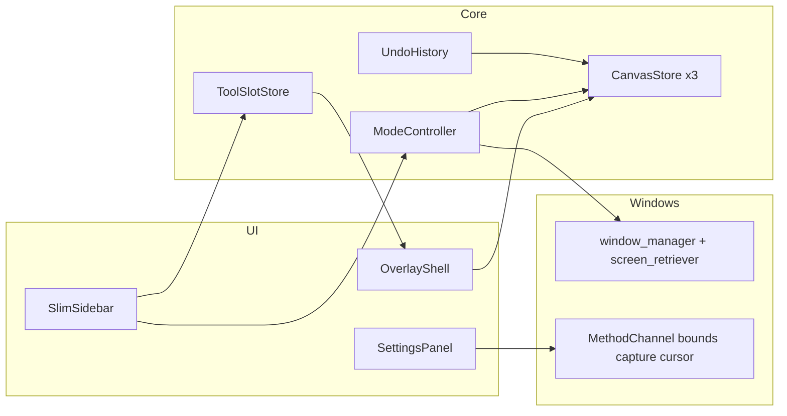

# Flutter Annotation App (Pen)

## Video analysis source

- Local recording: `[Sample Materials/20260804_130825.mp4](D:\AI\Pen\Sample Materials\20260804_130825.mp4)` (~588s, 1914×1080)
- Toolbar still: `[Sample Materials/Screenshot 2026-08-04 162809.png](D:\AI\Pen\Sample Materials\Screenshot 2026-08-04 162809.png)`
- Full Whisper transcript: `[Sample Materials/transcript.txt](D:\AI\Pen\Sample Materials\transcript.txt)`
- Analysis method: scenes mode (low threshold) + sheet montages + OCR (Tesseract) + local Whisper `small`

---

## What you want built (from transcript)

Cross-platform annotation app **like Epic Pen but more customizable**, starting on **Windows**, later **iPad + Android tablets**.

**Must keep (liked):** slim hideable vertical bar; whiteboard + blackboard; clear/highlighted mouse; pen; one-click eraser; per-size control (but per-tool); undo; trash; screenshot; settings; ~4 quick colors + full palette; optional fading ink later.

**Must fix / change vs Epic Pen:**

1. Board modes only affect the **monitor that currently hosts the app** (not all displays).
2. Covering the **taskbar is optional**.
3. **Pen, Text, Line, Rectangle** are **separate top-level toggles** (not nested under pen/shapes flyouts).
4. **Customizable bar:** multiple slots of the same tool (e.g. 2–3 Rectangles).
5. Each slot has its **own color and thickness** (and fill for rectangles). Changing Pen color must not change Rectangle.
6. Screenshot save location must be **explicit and visible** in settings.
7. **Three separate spaces:** Screen / Whiteboard / Blackboard — ink never leaks across modes (Epic Pen leaves board ink on the desktop when board turns off).

**Skip:** the unused/unclear second mouse option. Fading ink = nice-to-have if time allows.

---

## Screens you showed (scene timeline)


| Time (approx) | Screen / UI state                                                                    | What you demonstrated                                                                                    |
| ------------- | ------------------------------------------------------------------------------------ | -------------------------------------------------------------------------------------------------------- |
| 0:00–0:50     | Intro + Epic Pen toolbar over desktop/charts                                         | Goal: Epic Pen–like, more customizable; Windows + iPad + Android                                         |
| 0:50–1:30     | Slim bar hide/show; Whiteboard (white) / Blackboard (black)                          | Keep slim UI; show board modes                                                                           |
| 1:30–2:50     | Multi-monitor board fill; taskbar covered                                            | Pain: all monitors go white/black; taskbar always covered                                                |
| 2:50–3:20     | Mouse option flyout                                                                  | Keep clear mouse; reject other mouse option                                                              |
| 3:20–3:40     | Fading ink tooltip                                                                   | Optional keep                                                                                            |
| 3:40–4:00     | Pen flyout (Text nested under Pen)                                                   | Want Text as **separate** icon                                                                           |
| 4:00–6:00     | Shapes / filled rect demos on whiteboard                                             | Want Line + Rectangle as separate toggles; multiple rectangle slots; filled vs outline; different colors |
| 6:00–7:00     | Eraser one-click; thickness dots affecting all tools                                 | Keep eraser; make thickness **per tool/slot**                                                            |
| 7:00–7:30     | Undo + Trash                                                                         | Must have                                                                                                |
| 7:30–8:00     | Screenshot (camera)                                                                  | Need known save folder                                                                                   |
| 8:00–8:50     | **Settings** dialog (General, Quick Colors, Screenshot, Whiteboard, Ghost, Hot keys) | Study options; keep useful ones                                                                          |
| 8:50–9:30     | Quick colors + expanded palette                                                      | 4 quick colors OK + full palette                                                                         |
| 9:30–end      | Charts + Screen ink vs Whiteboard toggle                                             | Prove Epic Pen mixes ink; require **three canvases**                                                     |


Reference toolbar still (top → bottom): app/pen badge → eye (ink visibility) → cursor (submenu) → fading ink (submenu) → pencil (submenu) → shapes (submenu) → eraser → size circle → undo → trash → board (submenu) → camera → menu → 2×2 quick colors.

---

## Important OCR text (Epic Pen UI labels)

### Tooltips / mode labels

- `whiteboard (ctrl + shift + W)`
- `blackboard (ctrl + shift + B)`
- `fading ink (ctrl + shift + F)`
- Screenshot: `(ctrl + shift + PRINTSCREEN)`

### Settings → General (OCR)

- Remember content after exit
- **Each tool tracks its own size** (exists in Epic Pen; often off — we make per-slot size **always**)
- Mouse wheel adjusts pen size
- Start on Windows login
- Check for updates on startup
- Send anonymous usage telemetry…
- Expanded quick colors
- Language: English
- Quick color 1–4 (configurable swatches)
- Reset to default

### Settings → Screenshot (OCR)

- Always save screenshots to this folder: (path shown, e.g. `C:\Users\...\Desktop`)
- Always ask where to save… (alternate)
- Always take screenshot of entire desktop

### Settings → Whiteboard (OCR)

- **Whiteboard appears on all screens** (Epic Pen default — your pain point)
- Whiteboard appears on one screen (+ screen picker)

### Settings → Ghost mode (OCR)

- Enable ghost mode (hide toolbar; hotkeys only)
- Turn off tool notifications

### Settings → Hot keys (OCR samples)

- Toggle toolbar visibility — `ctrl + shift + 0`
- Toggle ink visibility — `ctrl + shift + 1` (approx)
- Cursor / fading ink / pen / eraser / clear / undo / screenshot
- Whiteboard `ctrl + shift + W` · Blackboard `ctrl + shift + B`
- Stroke size +/− · Quick color 1–4 `ALT + shift + 1..4`
- Deactivate

### Menu overflow

- About · Help · Close toolbar

---

## Important UI changes (Epic Pen → our app)




| Epic Pen UI                                                      | Our UI change                                                                |
| ---------------------------------------------------------------- | ---------------------------------------------------------------------------- |
| Text under Pen flyout                                            | **Separate Text toggle**                                                     |
| Line/Rect under Shapes flyout                                    | **Separate Line and Rectangle toggles**                                      |
| One of each tool                                                 | **Add/duplicate slots** (e.g. Rect A filled blue, Rect B red outline)        |
| Color often applies broadly                                      | Color binds to **active slot only**                                          |
| “Each tool tracks its own size” optional                         | Thickness always **per slot**                                                |
| Board on all screens (setting exists but defaults wrong for you) | **Always** current-app-monitor only (still allow explicit setting if useful) |
| Taskbar always covered by board                                  | Setting: cover taskbar yes/no                                                |
| Board off leaves board strokes on desktop                        | Hide board strokes; restore only in that mode; keep Screen strokes           |
| Cursor submenu with unused option                                | **Clear/highlighted mouse only**                                             |
| Screenshot folder buried                                         | Surfaced clearly; default path shown                                         |
| Nested size via dots                                             | Keep size control, scoped to active slot                                     |
| Eye / ghost / fading ink                                         | Eye optional MVP; ghost/fading post-MVP                                      |


**Sidebar target layout (ours):**

1. Collapse / app badge
2. Modes: Screen · Whiteboard · Blackboard (or board toggle + clear mouse)
3. Draw slots: Pen · Text · Line · Rectangle… (user-reorderable / addable)
4. Active-slot size control
5. Eraser · Undo · Trash · Screenshot
6. Settings
7. Quick colors 2×2 + expand to full palette

---

## Scope (MVP)

- **Framework:** Flutter  
- **MVP:** Windows transparent always-on-top overlay  
- **Phase 2:** iPad + Android tablet (shared drawing engine; in-app board, not OS overlay)  
- **Workspace:** `D:\AI\Pen`

## Architecture




| Mode       | Background                       | Visible + editable | Preserved hidden        |
| ---------- | -------------------------------- | ------------------ | ----------------------- |
| Screen     | Transparent                      | `screen`           | whiteboard + blackboard |
| Whiteboard | Opaque white on **this monitor** | `whiteboard`       | screen + blackboard     |
| Blackboard | Opaque black on **this monitor** | `blackboard`       | screen + whiteboard     |


## Project layout

```
lib/
  main.dart / app.dart
  platform/   window_service, display_service, screenshot_service, cursor_service
  models/     tool_slot, canvas_mode, drawable types, app_settings
  state/      tool_slot_store, canvas_store, settings_store, history_store
  drawing/    painter, hit_testing, gesture_controller
  ui/         overlay_shell, sidebar/*, palette/*, settings/*
```

**State:** Riverpod. Persist slots + settings via `shared_preferences`.  
**Packages:** `window_manager`, `screen_retriever`, `shared_preferences`, `file_picker`, `path_provider`, `uuid`, color picker.

## Implementation order

1. Transparent always-on-top Windows shell
2. Per-monitor bounds + cover-taskbar setting
3. Drawing engine + undo/trash
4. Three-canvas modes
5. Flat tool slots with independent color/thickness/fill + duplicate slots
6. Slim hideable sidebar + quick colors + palette
7. Eraser, screenshot folder, clear mouse
8. Settings panel (folder, taskbar, quick colors, hotkey baseline)
9. Persist + polish + `flutter build windows`

## Out of scope for MVP

- Shipping iPad/Android builds (architecture stays portable)  
- Unused mouse mode; ghost mode; fading ink (candidates later)  
- Click-through idle overlay  
- Telemetry / update checker (Epic Pen has these; we skip)

## Success criteria

- Whiteboard/Blackboard affects **only** the app’s current monitor  
- Taskbar cover is a user choice  
- Screen / Whiteboard / Blackboard ink never mixes  
- Separate Pen/Text/Line/Rectangle toggles; duplicate slots keep independent color, thickness, fill  
- Sidebar hides/shows like Epic Pen  
- Clear mouse works; screenshot saves to a known configurable folder

## Reference transcript (condensed)

Full text with timestamps is in `[Sample Materials/transcript.txt](D:\AI\Pen\Sample Materials\transcript.txt)`. Core ask: Epic Pen–style slim bar + boards, but single-monitor boards, optional taskbar cover, separate customizable tool slots with per-tool color/thickness, explicit screenshot folder, and three isolated drawing spaces.